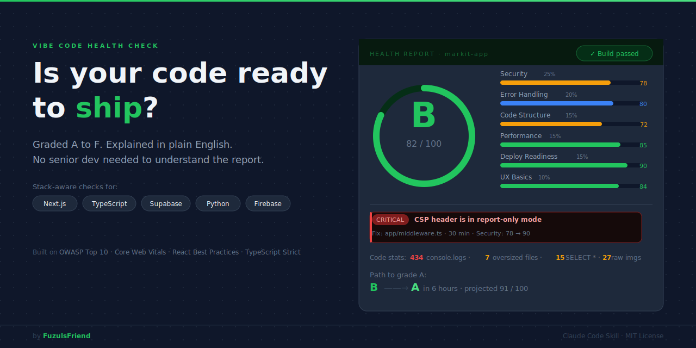

# Vibe Code Health Check

[](LICENSE)
[](SKILL.md)

Grade your code A to F. Get plain English fixes. No security background needed.

---

## You don't need to be a security expert to fix the issues

This skill reads your code and explains every finding in plain English. "Your security header is set to report-only mode: it logs violations but doesn't block anything" is something anyone can act on. So is "Your database password is written directly in the code." You get a letter grade, a numbered list of issues, and exact file paths to fix them. No jargon. No guesswork.

---

## What it checks

| Dimension | Weight | What it checks |
|-----------|--------|----------------|
| Security | 25% | Exposed secrets, unprotected routes, injection vulnerabilities |
| Error Handling | 20% | Missing try/catch, unhandled promises, code that crashes silently |
| Code Structure | 15% | File size, duplication, naming, organization |
| Performance | 15% | Bundle size, waterfall fetches, unoptimized assets |
| Deploy Readiness | 15% | Build pass/fail, environment config, .gitignore coverage |
| UX Basics | 10% | Loading states, error messages, mobile responsiveness |

---

## Grading scale

| Grade | Score | What it means |
|-------|-------|---------------|
| A | 90-100 | Production-ready. Ship it. |
| B | 80-89 | Almost there. Fix the warnings and you're good. |
| C | 70-79 | Functional but risky. Fix critical issues first. |
| D | 60-69 | Significant problems. Not safe to deploy yet. |
| F | Below 60 | Major security or stability issues. Do not ship. |

Side projects get adjusted weights: security stays high, structure and deployment are weighted lighter.

---

## Install

```bash
git clone https://github.com/FuzulsFriend/vibe-code-health-check ~/.claude/skills/vibe-code-health-check
```

Or copy `SKILL.md` directly into your `.claude/skills/` directory.

---

## Usage

Ask Claude:

```
Check my code
```

```
Is my app ready to ship?
```

```
Audit my project for security issues
```

---

## What you get

```
VIBE CODE HEALTH CHECK
━━━━━━━━━━━━━━━━━━━━━━━━━━━━━━━
Project: my-saas-app
Stack:   Next.js 14, TypeScript, Supabase, Vercel
Files:   312 | Lines: 28,400 | Dependencies: 47

Overall Grade: B (82/100)

BREAKDOWN:
  Security:         [████████░░]  78/100
  Error Handling:   [████████░░]  80/100
  Code Structure:   [███████░░░]  72/100
  Performance:      [████████░░]  85/100
  Deploy Readiness: [█████████░]  90/100
  UX Basics:        [████████░░]  84/100

CRITICAL (2) — Fix these before anyone uses your app:
1. "Your CSP header is in report-only mode: it logs violations but blocks nothing."
   Fix: app/api/middleware.ts — change Content-Security-Policy-Report-Only to Content-Security-Policy

2. "Your Stripe webhook accepts requests without verifying the signature."
   Fix: api/webhooks/stripe.ts — add Stripe.webhooks.constructEvent() verification

WARNINGS (3) — Fix these soon:
3. "434 places in your code log debug info to the browser console."
   Fix: Add ESLint rule: no-console
```

Plus a visual browser report with your grade badge, animated health bars, severity-color-coded findings with copy-to-clipboard file paths, a stats dashboard, and a step-by-step path to the next grade.

---

## Built on industry security and quality standards

Every finding in this skill traces back to a published standard maintained by the security or engineering community. That means the findings are objective, not opinions.

1. **[OWASP Top 10](https://owasp.org/www-project-top-ten/)** - The Open Web Application Security Project publishes the 10 most critical web application security risks. This list is updated by security professionals worldwide and is the most widely referenced standard for web security.

2. **[OWASP ASVS](https://owasp.org/www-project-application-security-verification-standard/)** - The Application Security Verification Standard is a framework of security requirements for designing, developing, and testing secure web applications. It gives this skill a structured checklist beyond just the top 10 risks.

3. **[Core Web Vitals](https://web.dev/vitals/)** - Google's official performance metrics tied to real user experience. Poor scores hurt your SEO ranking and reduce conversion rates.

4. **[TypeScript Strict Mode](https://www.typescriptlang.org/tsconfig#strict)** - Microsoft's strictest TypeScript configuration. Enabling it catches runtime errors at compile time, before users ever see them.

5. **[React Best Practices](https://react.dev/)** - Error boundaries, key props, performance optimization, and component design patterns from the official React documentation. These prevent the most common React bugs in production.

6. **[Next.js Best Practices](https://nextjs.org/docs)** - Image optimization, bundle splitting, server/client component boundaries, and deployment guidelines maintained by the Next.js team at Vercel.

7. **[npm audit](https://docs.npmjs.com/cli/v10/commands/npm-audit)** - Automated vulnerability detection that checks your dependencies against the npm security advisory database. Catches known vulnerabilities in packages you didn't write.

---

## What it catches (from real audits)

- API keys or secrets committed in source code
- Admin routes with no authentication
- SQL injection vulnerabilities
- Unhandled promise rejections that crash silently
- Missing error boundaries in React
- CSP headers in report-only mode instead of enforced
- Webhook endpoints that accept requests without signature verification
- Test login endpoints deployed to production
- Fragile import workarounds that break when someone "cleans up" the code
- Files over 500 lines doing too many things at once
- `SELECT *` queries that pull entire tables
- 434 console.logs scattered through production code

---

## Stack-aware analysis

The skill detects your stack automatically and applies the right checks for it.

- **Next.js / React** - Image optimization, server/client component boundaries, bundle size, React error boundaries
- **Python / Flask / FastAPI** - Route authentication, input validation, debug mode in production
- **Supabase** - Row Level Security policies, exposed service keys, unauthenticated queries
- **Firebase** - Security rules coverage, client-side data exposure, unauthenticated reads

---

## What's included

```
vibe-code-health-check/
├── SKILL.md                             # Main skill instructions
├── assets/
│   ├── banner.svg                       # Repository banner
│   ├── preview.png                      # Report preview screenshot
│   ├── report-template.md               # Text report template
│   └── report-ui.html                   # Visual browser report
└── references/
    ├── scoring-rubric.md                # Exact scoring criteria per dimension
    ├── security-patterns.md             # 8 vulnerability types with examples
    ├── react-nextjs-checks.md           # React/Next.js specific checks
    ├── python-flask-checks.md           # Python/Flask/FastAPI checks
    ├── supabase-firebase-checks.md      # BaaS security gotchas and positive credit
    ├── error-handling-rules.md          # Error handling patterns with code examples
    ├── performance-rules.md             # 6 performance rules with examples
    └── grade-thresholds.md              # What each grade (A-F) looks like
```

---

## Works best with

- **[Playwright CLI](https://github.com/lackeyjb/playwright-skill)** - Live browser testing catches issues static analysis misses
- **Chrome DevTools MCP** - Console errors and real page speed from a running browser
- **Agent Teams** - All 6 dimensions run in parallel for faster audits

Enable Agent Teams:
```bash
export CLAUDE_CODE_EXPERIMENTAL_AGENT_TEAMS=1
```

---

## License

MIT

---

*Made by [FuzulsFriend](https://github.com/FuzulsFriend)*
